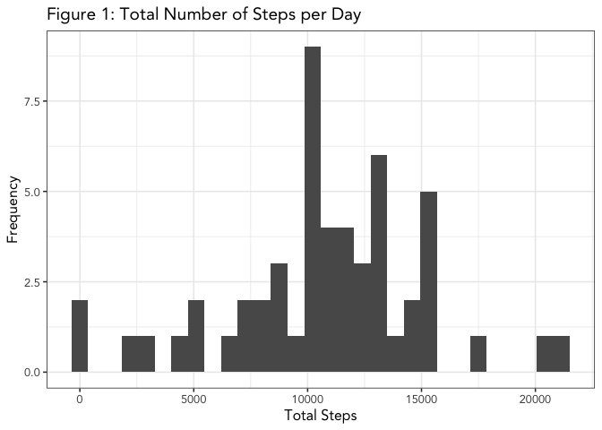
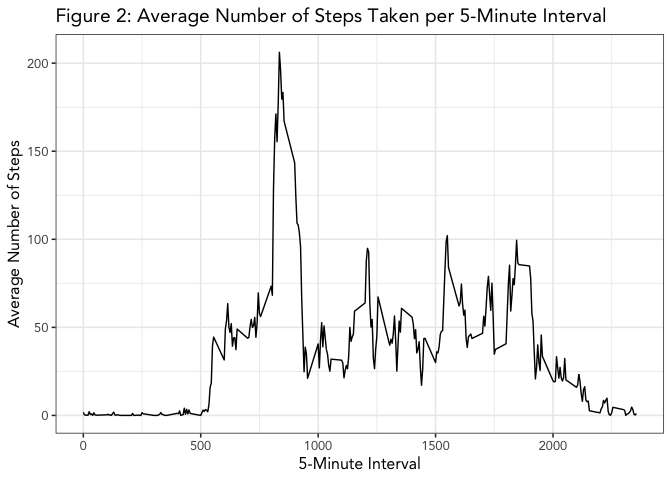
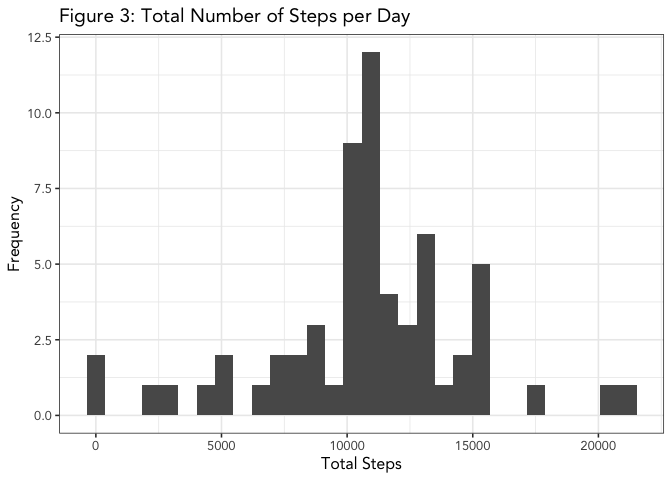
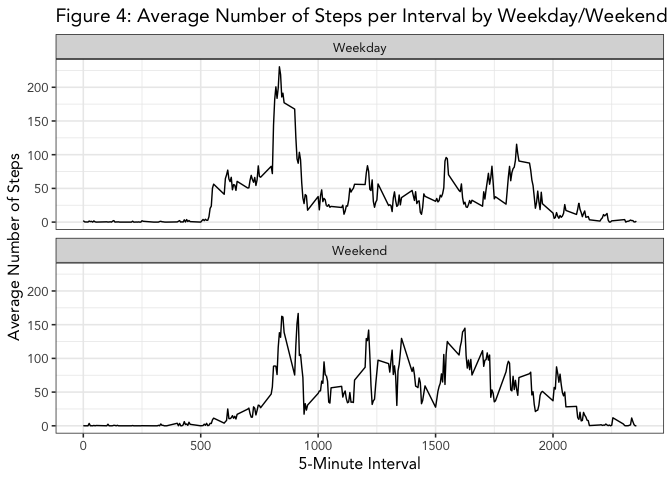

## Loading and preprocessing the data

We begin by setting up a few preliminaries for the environment. We will be making use of the **dplyr** and **ggplot2** libraries in this analysis.


```r
library(dplyr)
library(ggplot2)
```

Now, let's read in the data:


```r
filename <- "activity.zip"

if(!file.exists(filename)) {
    dataURL <- "https://d396qusza40orc.cloudfront.net/repdata%2Fdata%2Factivity.zip"
    download.file(dataURL, filename, method = "curl")
}

if(!file.exists("activity")) {
    unzip(filename)
}

activity <- read.csv("activity.csv", header = TRUE)
```

To begin, we'll need to convert the date field, which is currently a character variable, to a proper date variable in R.


```r
main <- activity %>%
    mutate(date = as.Date(date, format = "%Y-%m-%d"))
```

## What is mean total number of steps taken per day?

Now, onto the analysis. First, we'll compute the average number of steps taken per day. For now, we will ignore missing values. We will revisit that issue later.


```r
total1 <- main %>%
    filter(!is.na(steps)) %>%
    group_by(date) %>%
    summarize(total_steps = sum(steps))

mean_steps <- mean(total1$total_steps)
median_steps <- median(total1$total_steps)
```

From these calculations, we can see that the mean total number of steps taken per day is 10766.2, and the median total number of steps taken per day is 10765.

Let's look at a histogram of the total number of steps taken each day.


```r
plot1 <- ggplot(total1, aes(x = total_steps)) +
    geom_histogram() +
    labs(title = "Figure 1: Total Number of Steps per Day") +
    labs(x = "Total Steps", y = "Frequency") +
    theme_bw(base_family = "Avenir", base_size = 12)

print(plot1)
```

<!-- -->

From the histogram, we can see an average of around 10,000 steps per day.

## What is the average daily activity pattern?

Now, let's plot the average daily activity pattern. To do so, let's compute the average number of steps per 5-minute time interval and plot this as a time series. Again, we're omitting missing values for now.


```r
intervals <- main %>% 
    filter(!is.na(steps)) %>%
    group_by(interval) %>%
    summarize(average_steps = mean(steps))

plot2 <- ggplot(intervals, aes(x = interval, y = average_steps)) +
    geom_line(stat = "identity") +
    labs(title = "Figure 2: Average Number of Steps Taken per 5-Minute Interval") +
    labs(x = "5-Minute Interval", y = "Average Number of Steps") +
    theme_bw(base_family = "Avenir", base_size = 12)

print(plot2)
```

<!-- -->

From the line plot, we see fairly inactive steps counts from interval 0 through 500, which corresponds to midnight to 5:00 a.m. Then, the average step count increases in the mid-morning before reducing again and becoming fairly cyclic during the afternoons before tapering off after interval 2000, which corresponds to 8:00 p.m.

The 5-minute interval that, on average, contains the maximum number of steps can be calculated in R as follows:


```r
intervals$interval[which.max(intervals$average_steps)]
```

```
## [1] 835
```

Thus, interval 835, which corresponds to a clock time interval of 8:35-8:40 a.m., is where the peak average number of steps occurs. This is consistent with what we see in the time series plot.

## Imputing missing values

As we remarked before, there are missing observations in this dataset.  Let's first look at just how much missing data we have.


```r
sum(is.na(main$steps)) / nrow(main)
```

```
## [1] 0.1311475
```

So, we have about 13% of the step counts missing. This is not trivial. We ignored them previously, but now we will apply a imputation strategy. For simplicity, let's use the average number of steps across all days for the given 5-minute interval to impute a missing value. We already computed this in the **intervals** dataset, so we will merge that to our **main** analysis dataset and create a new variable _steps2_ that will simply be _steps_ if it not missing or imputed to the mean of that interval if it is missing.


```r
main2 <- inner_join(main, intervals, by = "interval") %>%
    mutate(steps2 = if_else(!is.na(steps), steps, average_steps))
```

Now, let's re-compute the total number of steps per day using this imputed data and plot the histogram again. Let's also re-compute the mean and median total number of steps.


```r
total2 <- main2 %>%
    group_by(date) %>%
    summarize(total_steps2 = sum(steps2))

plot3 <- ggplot(total2, aes(x = total_steps2)) +
    geom_histogram() +
    labs(title = "Figure 3: Total Number of Steps per Day") +
    labs(x = "Total Steps", y = "Frequency") +
    theme_bw(base_family = "Avenir", base_size = 12)

print(plot3)
```

<!-- -->

```r
mean_steps2 <- mean(total2$total_steps2)
median_steps2 <- median(total2$total_steps2)
```

As we can see, the new histogram does not look appreciably different from the original one, and the new mean and median (10766.2 and 10766.2, respectively) are also quite similar. In fact, the original mean and the new mean are the same, as expected since we used the mean to impute a missing value.

## Are there differences in activity patterns between weekdays and weekends?

Let's now consider whether there may be a difference in the total number of steps taken during the week versus during the weekend. To do this, we first need to classify the _date_ variable into a factor with two levels: "Weekday" or "Weekend." We'll add this variable to the **main2** dataset, keeping the imputation strategy we employed earlier.


```r
main2 <- main2 %>%
    mutate(weekday = weekdays(date), 
           day = as.factor(if_else(weekday %in% c("Saturday", "Sunday"), 
                                   "Weekend", "Weekday")))
```

Now, let's compute the average number of steps per day, separately for weekdays and weekends.


```r
final <- main2 %>%
    group_by(day, interval) %>%
    summarize(average_steps = mean(steps2))
```

Let's create a panel plot of these averages, separately for weekdays and weekends.


```r
plot4 <- ggplot(final, aes(x = interval, y = average_steps)) +
    geom_line(stat = "identity") +
    facet_wrap(day ~ ., nrow = 2) +
    labs(title = "Figure 4: Average Number of Steps per Interval by Weekday/Weekend") +
    labs(x = "5-Minute Interval", y = "Average Number of Steps") +
    theme_bw(base_family = "Avenir", base_size = 12)

print(plot4)
```

<!-- -->

From the panels, we can see generally similar activity trend. The peak at around 8:30 a.m. is not quite as strong on the weekend, but the general trend is still a peak around that time, followed by a dip, followed by cyclic patterns in the afternoon before tapering off after 8:00 p.m. If anything, the weekend afternoon cyclic patterns are more pronounced than their weekday counterparts.
